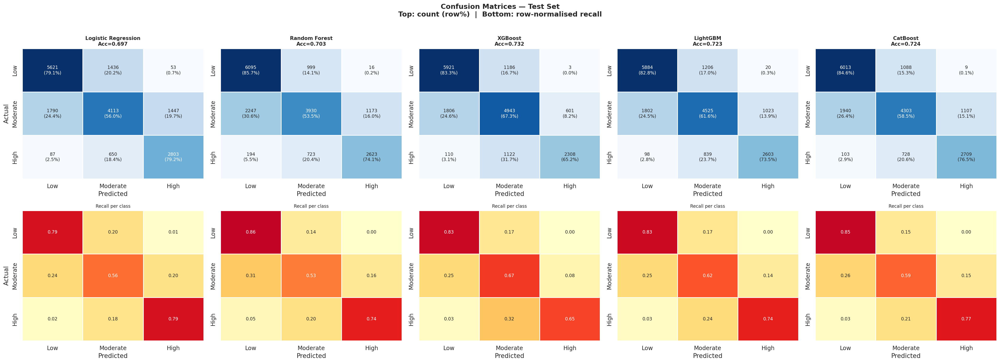
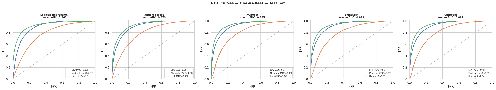
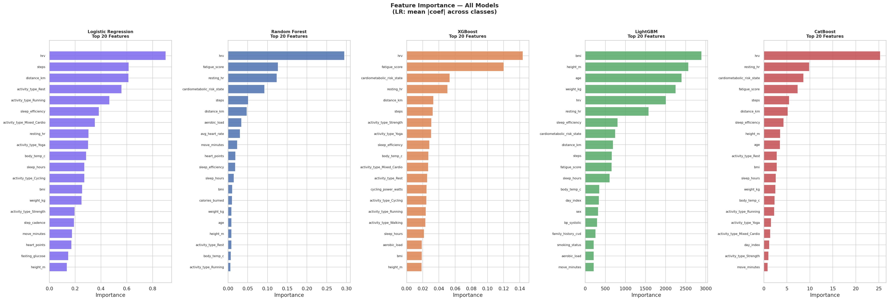

# Machine Learning System for Fitness Level Classification

A machine learning pipeline that predicts a user's fitness level (Low, Moderate, High) using Google Fit activity data, health metrics, and engineered physiological features.

## Overview

This project develops a comparative machine learning framework for personalized fitness classification using longitudinal wearable and health data.

## Dataset

The dataset consists of 90,000 records collected from 3,000 individuals, with 30 daily observations per user.

### Included Features

- Activity metrics
  - Steps
  - Move Minutes
  - Heart Points

- Sleep metrics
  - Sleep Hours
  - Sleep Efficiency

- Health measurements
  - BMI
  - Blood Pressure
  - Blood Glucose

### Target Variable

| Class | Fitness Level |
|---------|---------|
| 0 | Low |
| 1 | Moderate |
| 2 | High |

## Methodology

### Data Preprocessing

- User-level train/test split (80/20)
- Median imputation
- One-hot encoding
- Feature standardization

### Feature Engineering

Added features:

- `hp_efficiency`
- `pulse_pressure`
- `aerobic_load`
- `glucose_ratio`
- `bmi_cat`

## Models Evaluated

- Logistic Regression
- Random Forest
- XGBoost
- LightGBM
- CatBoost

## Validation Strategy

### GroupKFold Cross-Validation

Samples belonging to the same user were never split across training and validation folds.

## Results

| Model | Accuracy | F1 Macro | F1 Weighted | ROC-AUC |
|---------|---------:|---------:|---------:|---------:|
| Logistic Regression | 0.6965 | 0.6972 | 0.6925 | 0.8611 |
| Random Forest | 0.7027 | 0.6991 | 0.6949 | 0.8725 |
| XGBoost | **0.7318** | **0.7283** | **0.7301** | 0.8852 |
| LightGBM | 0.7229 | 0.7216 | 0.7200 | 0.8788 |
| CatBoost | 0.7236 | 0.7225 | 0.7188 | **0.8867** |

### Best Performing Model

**XGBoost**

- Accuracy: **73.18%**
- F1 Macro: **72.83%**
- ROC-AUC: **88.52%**

## Visualizations

## Technologies Used

- Python
- Pandas
- NumPy
- Scikit-Learn
- XGBoost
- LightGBM
- CatBoost
- Matplotlib
- Seaborn

## Authors

- Riya Gupta
- Shalini Dubey

